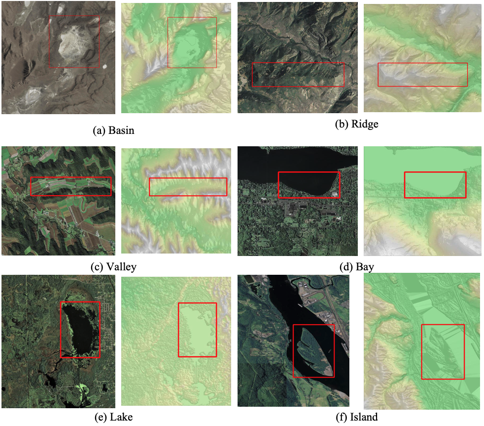
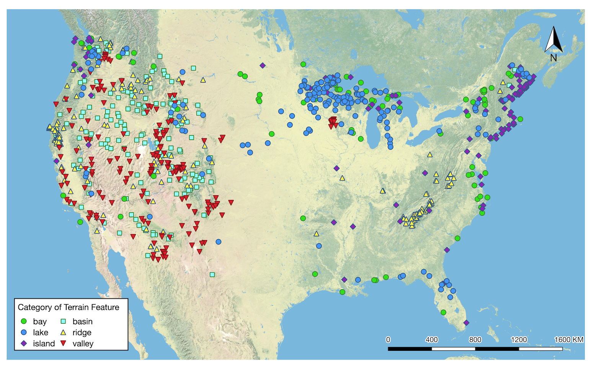

# GeoImageNet

GeoImageNet a multi-source natural feature benchmark dataset for GeoAI and is suited for the supervised machine learning tasks such as classification and object detection. A distinctive feature of this dataset is the fusion of multi-source data, including both remote sensing imagery and DEM in depicting spatial objects of interest. This multi-source dataset allows a GeoAI model to extract rich spatio-contextual information to gain stronger confidence in high-precision object detection and recognition. The image dataset is tested with a multi-source GeoAI extension against two well-known object detection models, Faster-RCNN and RetinaNet. The results demonstrate the robustness of the dataset in aiding GeoAI models to achieve convergence and the superiority of multi-source data in yielding much higher prediction accuracy than the commonly used single data source.

This dataset contains 876 image pairs from 6 natural feature categories: basins, bays, islands, lakes, ridges, and valleys. The spatial resolution of the images (for both remote sensing imagery and DEM) is at 10 meters. Since the scales of the natural features differ, the image sizes vary from 283 x 213 to 4584 x 4401, with an average size of 635.44 x 593.45. The statistics of feature type and count of this dataset can be found in the following table:

|Category|# of image pairs|
|--|--|
|**Basin**|155|
|**Ridge**|171|
|**Valley**|181|
|**Bay**|93|
|**Island**|106|
|**Lake**|170|
|sum|876|

## Data Sample


## Geographic Distribution

The features in this dataset are widely distributed in 44 states of the US, including Hawaii but not in Alaska due to lack of high-resolution data source in that region. California and Utah host the most selected features, especially in the categories of basin, valley and ridge. Bays and lakes are mostly found in the northeastern states, Washington and Florida. Islands are located in coastal and Great Lake states. 


## Dataset Annotations and Download

We split the dataset into training and testing set with a 8:2 ratio. The annotation information is stored in file `gin.train.txt` and `gin.test.txt` respectively. You can also create your own split based on these two files. The annotation files share the same format to encode the data labels. Each line in the annatation file labels a natural feature indicated by its bounding box, category, and corresponding image file, following this pattern: 

```
relative_path_to_image_file, x_min, y_min, x_max, y_max, category
```

`relative_path_to_image_file` indicates the relative path to the remote sensing imagery file. The corresponding DEM file can be referred using the similar path but with the different postfix of the file name. `x_min` and `y_min` indicate the coordinate of the top-left corner of the bounding box, while `x_max`, and `y_max` is for the bottom-right corner of the bounding box. `category` indicates the category of the natural feature. 

The download link for the corresponding imageries and DEMs can be found [HERE](http://cici.lab.asu.edu/datasets/geoimagenet.zip) [102 MB].

#### Dataset with offline data augmentation

We also prepared the training annotation file `gin.train.aug.txt` used for the offline data augmentation training. This annotation is directly extended from `gin.train.txt`, incorporate several data augmentation metheds, including rotation, image inversion, color removal, pepper and salt noise injection, and Gaussian noise injection.

The download link for the corresponding imageries and DEMs with data augmentation can be found [HERE](http://cici.lab.asu.edu/datasets/geoimagenet.aug.zip) [965 MB].

Finally, unzip the downloaded data file at directory `data` in this repo.

## Cite This Dataset

Li, W., Wang, S., Arundel, S.T. et al. GeoImageNet: a multi-source natural feature benchmark dataset for GeoAI and supervised machine learning. Geoinformatica (2022). https://doi.org/10.1007/s10707-022-00476-z